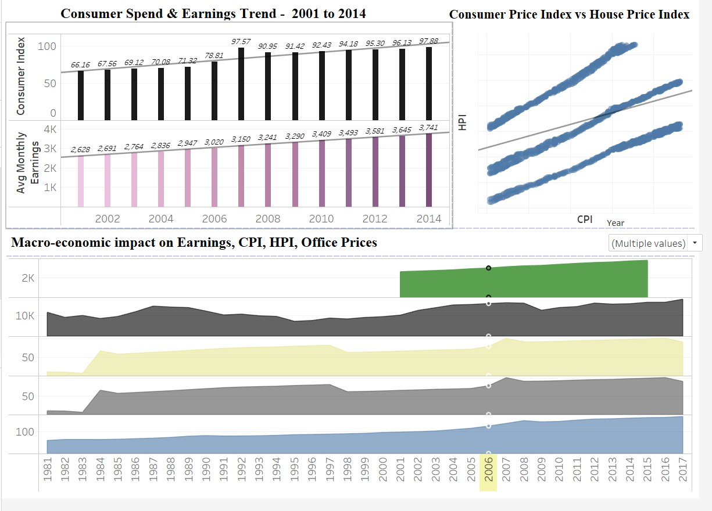

# Final-Project-Tableau

## Project/Goals
Data Sourcing, Data Cleaning, Data Transformation, Data Analysis, Data Visualization

## Process
Data Sourcing - utilized the 6 datasets provided
Data Cleaning - Changed datatype from string to date to be able to project a time series chart; reviewed the dataset and ensured only necessary fields are maintained
Data Transformation - pasred json file (weekly earnings) into csv and created calculated columns in Tableau for monthly earnings
Data Analysis - Added new data source and created relationship using date column
Data Visualization -Added new data source and created relationship using date column

## Results
•	Weekly earnings from 1.1.2001 to 15.4.2015 (weekly_earnings - CSV)
•	Housing constructions from 1955 to 2019 (real_estate_numbers - CSV)
•	House prices from 1.1.2005 to 1.9.2020 (real_estate_prices - EXCEL)
•	Housing_price_index from November 1979 to September 2020
•	Office_realestate_index from November 1979 to September 2020
•	Consumer index from November 1979 to September 2020

## Challenges 
Limitations for the weekly earnings file
For each month, weekly figures are provided but did not state how many weeks are there in each month. I multiplied by the standard 4 weeks per month to get 48 weeks and not 52 weeks – “4 weeks out”. For this reason, it only makes sense to create calculated fields for yearly salary. 

## Future Goals
I would make the Tableau more interactive
